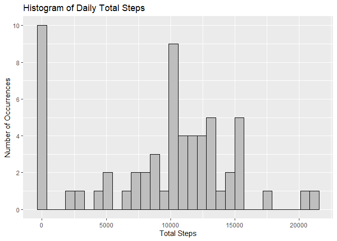
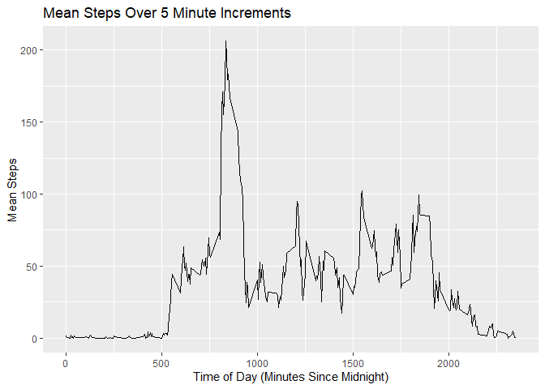
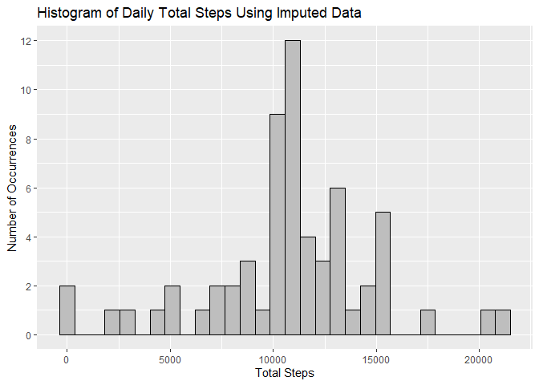
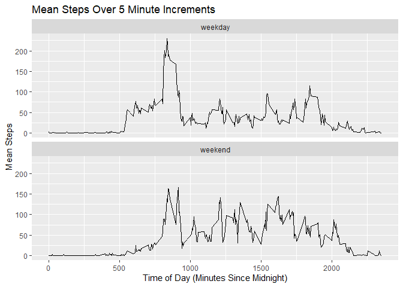

## Loading and preprocessing the data
As shown below, the extracted data set is loaded using read_csv from readr with explicit column type specification. As per instructions, the NA values are ignored for now.


```r
library(tidyverse)
```

```
## -- Attaching packages --------------------------------------- tidyverse 1.3.1 --
```

```
## v ggplot2 3.3.5     v purrr   0.3.4
## v tibble  3.1.6     v dplyr   1.0.7
## v tidyr   1.1.4     v stringr 1.4.0
## v readr   2.1.1     v forcats 0.5.1
```

```
## -- Conflicts ------------------------------------------ tidyverse_conflicts() --
## x dplyr::filter() masks stats::filter()
## x dplyr::lag()    masks stats::lag()
```

```r
activityData <- read_csv("activity/activity.csv", col_types = list(steps = col_integer(), date = col_date(format = ""), interval = col_integer()))
```

## What is mean total number of steps taken per day?
This analysis occurs by grouping the interval step data by date and then calculating the total, mean, and median number of steps taken per day. A histogram of the total number of steps taken is shown first followed by a table reporting the mean and median total number of steps taken per day (found to be 9354 and 10395 respectively).


```r
dailySteps <- activityData %>% group_by(date) %>% summarize(totalSteps = sum(steps, na.rm = TRUE), meanSteps = mean(steps, na.rm = TRUE), medianSteps = median(steps, na.rm = TRUE))

ggplot(dailySteps, aes(x = totalSteps), inherit.aes = FALSE) + 
    geom_histogram(bins = 30, color = "black", fill = "gray", na.rm = TRUE) +
    labs(title = "Histogram of Daily Total Steps", x = "Total Steps", y = "Number of Occurrences") + 
    scale_y_continuous(breaks = seq(0,10,2))
```



```r
dailySteps %>% summarize(meanTotalSteps = mean(totalSteps, na.rm = TRUE), medianTotalSteps = median(totalSteps, na.rm = TRUE))
```

```
## # A tibble: 1 x 2
##   meanTotalSteps medianTotalSteps
##            <dbl>            <int>
## 1          9354.            10395
```

## What is the average daily activity pattern?
This analysis shows a plot of the average steps taken during each 5 minute interval (averaged across the recorded duration) and identifies 8:35-8:40 AM as the interval with the most recorded steps (206).


```r
intervalSteps <- activityData %>% group_by(interval) %>% summarize(totalSteps = sum(steps, na.rm = TRUE), meanSteps = mean(steps, na.rm = TRUE), medianSteps = median(steps, na.rm = TRUE))

ggplot(intervalSteps, aes(x = interval, y = meanSteps), inherit.aes = FALSE) +
    geom_line(na.rm = TRUE) +
    labs(title = "Mean Steps Over 5 Minute Increments", x = "Time of Day (Minutes Since Midnight)", y = "Mean Steps")
```



```r
intervalSteps %>% slice_max(meanSteps) %>% select(interval, meanSteps)
```

```
## # A tibble: 1 x 2
##   interval meanSteps
##      <int>     <dbl>
## 1      835      206.
```

## Imputing missing values
In this section, I used imputation to fill in missing values. I identified 2304 rows missing in this data set. I chose to replace missing values with the mean of the 5 minute interval to which each missing value belongs. This new data set is then used to repeat the earlier analysis by constructing a histogram of the total number of steps taken each day. The calculated mean and median steps per day were both found to be 10766, increased relative to the comparable values calculated earlier. Imputing the missing data increased the estimates of the total daily number of steps.


```r
missingRows <- nrow(activityData) - nrow(activityData %>% drop_na())
print(missingRows)
```

```
## [1] 2304
```

```r
imputedData <- activityData %>% group_by(interval) %>% mutate(steps = ifelse(is.na(steps), mean(steps, na.rm = TRUE), steps))

dailyImpSteps <- imputedData %>% group_by(date) %>% summarize(totalSteps = sum(steps), meanSteps = mean(steps), medianSteps = median(steps))

ggplot(dailyImpSteps, aes(x = totalSteps), inherit.aes = FALSE) + 
    geom_histogram(bins = 30, color = "black", fill = "gray") +
    labs(title = "Histogram of Daily Total Steps Using Imputed Data", x = "Total Steps", y = "Number of Occurrences") + 
    scale_y_continuous(breaks = seq(0,12,2))
```



```r
dailyImpSteps %>% summarize(meanTotalSteps = mean(totalSteps), medianTotalSteps = median(totalSteps))
```

```
## # A tibble: 1 x 2
##   meanTotalSteps medianTotalSteps
##            <dbl>            <dbl>
## 1         10766.           10766.
```

## Are there differences in activity patterns between weekdays and weekends?

In this final section, I first divided the data into that collected on the weekdays and that collected on the weekends. Grouping by both interval and weekend/weekday permitted plotting of steps per 5 minute increment averaged over the weekdays and weekends. This plot and the calculated averages per day (corrected from the first-calculated average steps/5 minutes) show that 1) approximately 2,000 more steps are taken on weekend days (12,202 vs 10,256), 2) that weekdays start earlier by several hours on average as observed by the time when the average steps reaches 25 or 50, and 3) the weekday step distribution shows a sharp morning peak followed by decreased activity throughout the day while the weekend distribution shows no more than a slight bias in steps taken in the first half of the distribution.


```r
imputedData$dayType <- factor((weekdays(imputedData$date) %in% c("Saturday", "Sunday")), levels = c(FALSE, TRUE), labels = c("weekday", "weekend"))
weekendSteps <- imputedData %>% group_by(dayType, interval) %>% summarize(meanSteps = mean(steps))
```

```
## `summarise()` has grouped output by 'dayType'. You can override using the `.groups` argument.
```

```r
ggplot(weekendSteps, aes(x = interval, y = meanSteps), inherit.aes = FALSE) +
    geom_line(na.rm = TRUE) +
    facet_wrap(~dayType, ncol = 1) +
    labs(title = "Mean Steps Over 5 Minute Increments", x = "Time of Day (Minutes Since Midnight)", y = "Mean Steps")
```



```r
averageSteps <- imputedData %>% group_by(dayType) %>% summarize(meanSteps = mean(steps))
averageSteps$meanSteps <- 24*60/5*averageSteps$meanSteps
print(averageSteps)
```

```
## # A tibble: 2 x 2
##   dayType meanSteps
##   <fct>       <dbl>
## 1 weekday    10256.
## 2 weekend    12202.
```
